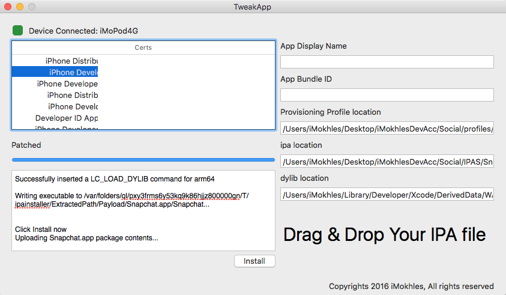

# DEPRECATED
use [iMokhles / IMSign](https://github.com/iMokhles/IMSign)

# TweakApp

tweaking/signing/sideloading apps within the same Application 

NOTE
------

this app isn't for piracy usage so use it legally please.

this app made for developer who need modify runtime codes ( to add some new cool features ) not for steal or break softwares

we are here to add cool features aren't existe by default in the apps

  

Usage
------

* open TweakApp.app
* connect your iDevice ( iphone, ipad, ipod )
* select developer certificate from the list
* type app display name ( which will appear in springboard )
* type app bundle id ( same as provisioning profile bundle ID )
* Drag & Drop the not signed app ( ipa file )
* Drag & Drop the provisioning profile ( should be with .mobileprovision extension )
* Drag & Drop the dylib you need to be loaded with the app
* click Sign ( wait till the app say Click Extract )
* click Extract ( wait till the app say Click Patch )
* click Patch ( wait till the app say Click Install )
* click Install ( wait till the app say Complete )

Credits
------

[Alexzielenski / optool](https://github.com/alexzielenski/optool)

[iMokhles / AppSignerCMD](https://github.com/iMokhles/AppSignerCMD)

[libimobiledevice](https://github.com/libimobiledevice/libimobiledevice)

#MIT License

	Copyright (c) 2016 iMokhles (Mokhlas Hussien). All rights reserved.

	Permission is hereby granted, free of charge, to any person obtaining a
	copy of this software and associated documentation files (the "Software"),
	to deal in the Software without restriction, including
	without limitation the rights to use, copy, modify, merge, publish,
	distribute, sublicense, and/or sell copies of the Software, and to
	permit persons to whom the Software is furnished to do so, subject to
	the following conditions:

	The above copyright notice and this permission notice shall be included
	in all copies or substantial portions of the Software.

	THE SOFTWARE IS PROVIDED "AS IS", WITHOUT WARRANTY OF ANY KIND, EXPRESS
	OR IMPLIED, INCLUDING BUT NOT LIMITED TO THE WARRANTIES OF
	MERCHANTABILITY, FITNESS FOR A PARTICULAR PURPOSE AND NONINFRINGEMENT.
	IN NO EVENT SHALL THE AUTHORS OR COPYRIGHT HOLDERS BE LIABLE FOR ANY
	CLAIM, DAMAGES OR OTHER LIABILITY, WHETHER IN AN ACTION OF CONTRACT,
	TORT OR OTHERWISE, ARISING FROM, OUT OF OR IN CONNECTION WITH THE
	SOFTWARE OR THE USE OR OTHER DEALINGS IN THE SOFTWARE.
	
